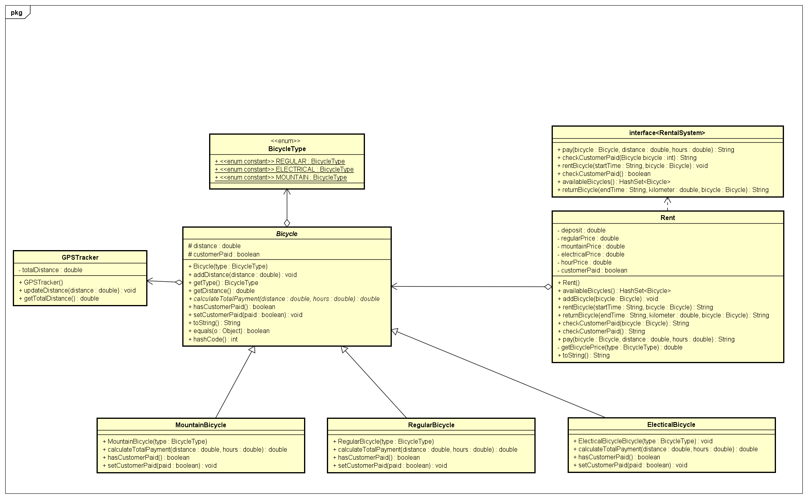

# StartDocoument

## Description:

The NS Group wants new software to track the rental of their bicycles. The software should track how many **bicycles** are still available for rental. There are  three types of bikes: a regular one, mountain bike and electrical bike. A  customer can **rent** a bicycle for a certain amount of time. *The end time will be registered when the customer returns the bike*. In every bicycle is a **GPStracker**. The tracker tracks the distance the customer has travelled with the bicycle. *When the customers starts renting he has to pay deposit from €20*,-.  The customer has to pay money per kilometre. This is: > €0,20 for a regular bike; > €0,25 for a mountain bike; > €0,50 for a electrical bike. Per hour the customer has to pay €2,-. *When the customer returns the bike,  the customer has to pay*. For maintenance purposes the company wants to  know the total distance the bike has been used.

Functionalities:

* Track how many **bicycles** are still available for rental - availableBicycles(): HashSet<Bicycle>
* Customer rents bicycle - rentBicycle(startTime): void
  * check if the bicycle is available
  * use time type (example 14:00)
* Customer returns bicycle -returnBicycle(endTime, kilometer): void
  * register end time
  * use time type (example 17:00)
  * kilometer is distance
* Track bicycles to track distance, return list of bicycle with total distance
* Check if customer paid after returning the bicycle checkCustomerPaid()
* Customer pays after returning pay()

Type:

* Regular Bicycle
* Mountain Bicycle
* Electrical Bycycle

Calculations:

* The customer starts renting he/she has to pay deposit from €20
* The customer has to pay money per kilometre
  * more then €0,20 for a regular bike
  * more then €0,25 for a mountain bike
  * more then €0,50 for a electrical bike
* Per hour the customer has to pay €2

## Classes:

1. Bicycle
2. ReqularBike
3. MountainBike
4. ElectricalBike
5. Rent

### Input & Output

In this section, the input and output of the application will be described.

#### Input

In the table below, all the necessary inputs are described:

| Case             | Type                          | Conditions |
| ---------------- | ----------------------------- | ---------- |
| Customer details | `String`                      | not empty  |
| Rental details   | `String`, `Bicycle`           | not empty  |
| Return details   | `String`, `Bicycle`, `double` | not empty  |
| Payment details  | `Bicycle`, `double`, `double` | not empty  |

#### Output

| Case                    | Type               |
| ----------------------- | ------------------ |
| Available bicycles      | `HashSet<Bicycle>` |
| Rental status           | `String`           |
| Return status           | `String`           |
| Customer payment status | `String`           |
| Total payment           | `double`           |

#### Calculations

| Case          | Calculation                                                  |
| ------------- | ------------------------------------------------------------ |
| Total payment | Distance multiplied by the bicycle price and hours, minus the deposit. |

#### Remarks

- Input will be validated.
- Only the Main class will contain `System.out.println`.
- Unit Tests will be provided.

## UML:

Additional info

calculateRentalPrice()

returnBicycle()

getDistance()
